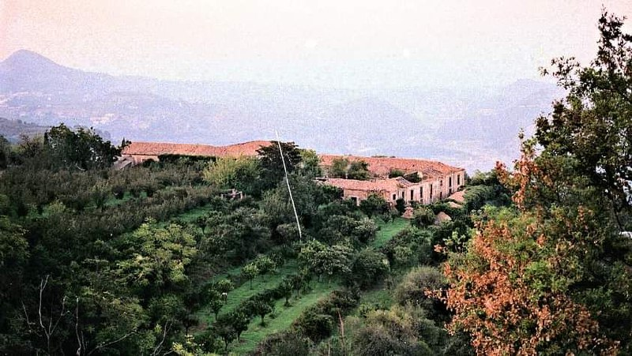
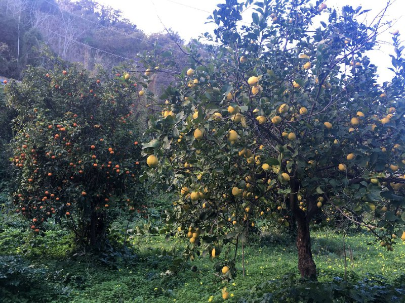

# San Pancrazio
Azienda Agricola Biologica - Work In Progress

## About Us
  
San Pancrazio is an open space for collaborative agriculture in the province of Messina (Librizzi)

## Contact Us

[Send Us An Email](mailto:lunde@adobe.com?subject=[GitHub]%20Source%20Han%20Sans)

## Links

* [instagram](https://www.instagram.com/cucuzcora)
